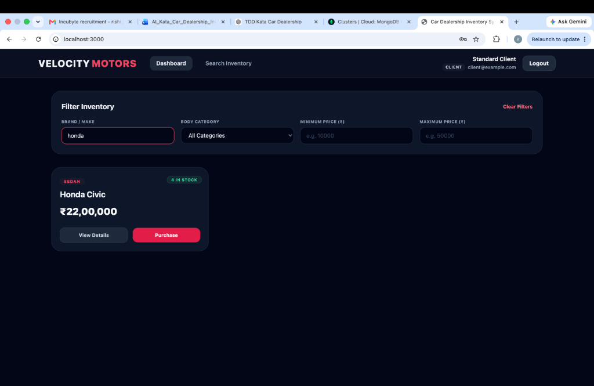
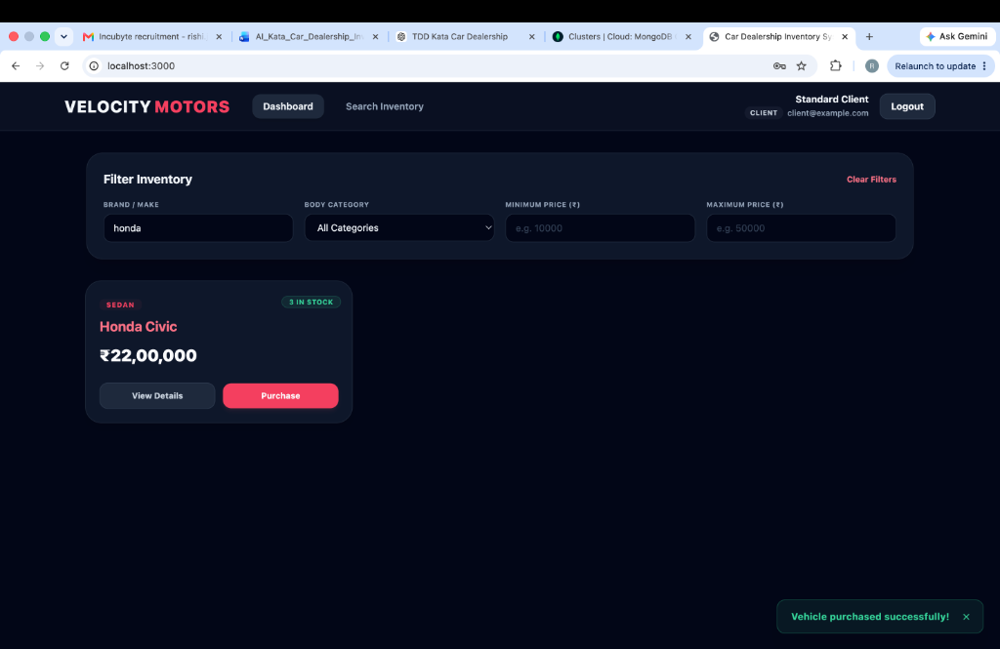
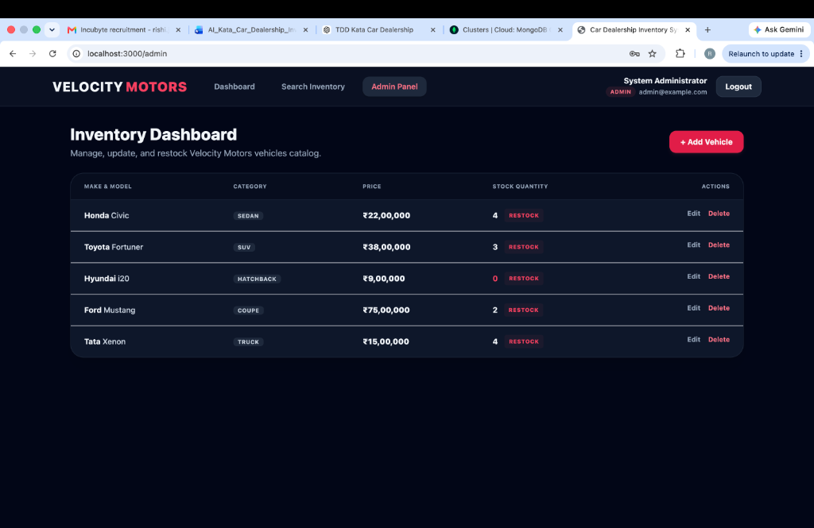
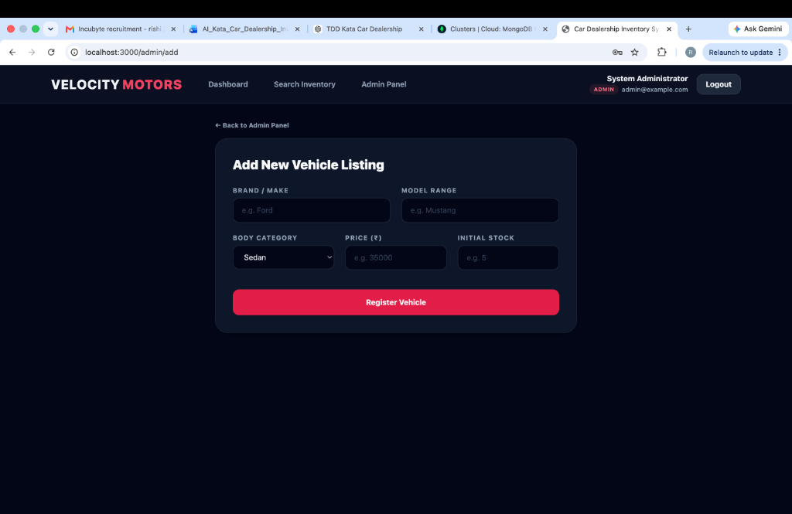
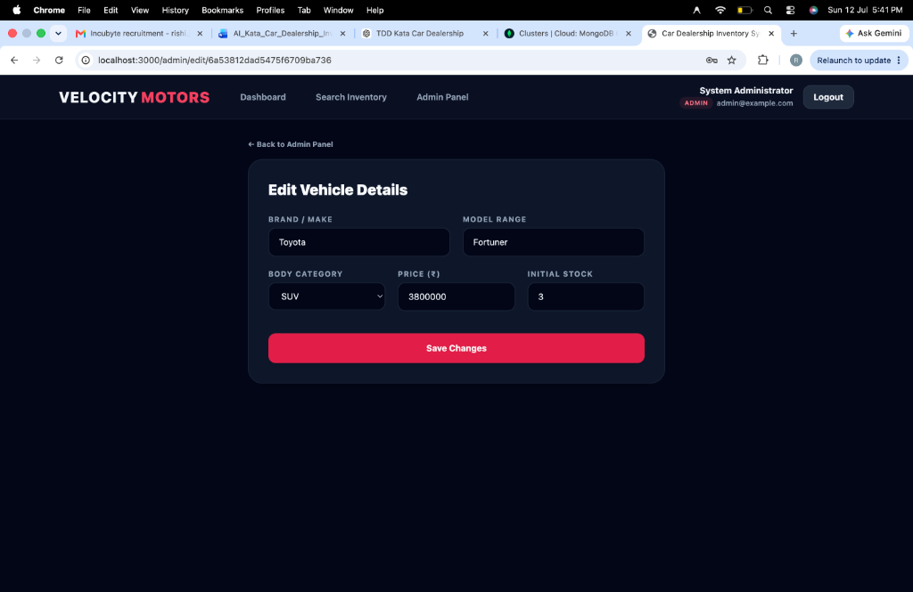

# Velocity Motors - Car Dealership Inventory System

Velocity Motors is a production-quality, secure, full-stack Car Dealership Inventory System designed and built using Test-Driven Development (TDD) principles. It includes an Express REST API backend and a responsive React Single-Page Application (SPA) frontend styled with Tailwind CSS.

---

## Project Overview

Velocity Motors enables users to browse, search, and purchase vehicles. It features role-based access control where clients can search the catalog and purchase available vehicles, while administrators have access to an inventory control panel to create new listings, edit specifications, restock inventories, and delete items.

---

## Tech Stack

### Backend
- **Node.js** & **Express.js**: Core server framework.
- **MongoDB Atlas**: Cloud NoSQL database.
- **Mongoose**: Object Data Modeling (ODM).
- **JWT (JSON Web Tokens)**: Secure token-based session authentication.
- **bcrypt**: Secure password hashing.
- **express-validator**: Endpoint input validation middleware.
- **Jest** & **Supertest**: Testing runner and endpoint verification tools.

### Frontend
- **React (Vite)**: UI building block.
- **React Router DOM**: Client-side application routing.
- **Axios**: HTTP requests with automatic request interceptors.
- **Tailwind CSS**: Dark-mode premium dealership styling.
- **React Context API**: Global authentication state and token management.

---

## Folder Structure

```text
car-dealership/
├── backend/
│   ├── src/
│   │   ├── config/          # DB connections configuration
│   │   ├── controllers/     # HTTP controllers handlers
│   │   ├── middleware/      # Auth security & admin gates
│   │   ├── models/          # Mongoose schemas (User, Vehicle)
│   │   ├── routes/          # Express route mappings
│   │   ├── services/        # Core business transactions
│   │   ├── validators/      # express-validator criteria
│   │   ├── tests/           # Jest & Supertest TDD suites
│   │   └── app.js           # App configs
│   ├── .env                 # Server configuration settings
│   ├── jest.config.js       # Jest configs
│   └── package.json         # Backend node packages
├── frontend/
│   ├── src/
│   │   ├── components/      # Toast alerts, modals, vehicle cards
│   │   ├── context/         # AuthContext session states
│   │   ├── layouts/         # AuthLayout, MainLayout wrappers
│   │   ├── pages/           # Forms and dashboards
│   │   ├── services/        # api.js and vehicleService.js
│   │   ├── App.jsx          # Routes nesting configuration
│   │   ├── main.jsx         # DOM mounting entry
│   │   └── index.css        # Tailwind base directives
│   ├── tailwind.config.js   # Tailwind theme configurations
│   ├── index.html           # HTML template
│   └── package.json         # Frontend packages
└── README.md                # System documentation
```

---

## Environment Variables

### Backend (`backend/.env`)
Create a `.env` file in the `backend/` directory:
```env
PORT=5005
MONGODB_URI=mongodb+srv://<db_username>:<db_password>@cluster...
JWT_SECRET=yoursecretkey
JWT_EXPIRES_IN=7d
```

### Backend Test Environment (`backend/.env.test`)
Create an `.env.test` file in the `backend/` directory to configure Jest:
```env
PORT=5001
MONGODB_URI=mongodb://localhost:27017/car_dealership_test
JWT_SECRET=testsecret
JWT_EXPIRES_IN=1h
```

---

## Installation & Running Locally

### Prerequisites
- Node.js installed (v18+ recommended)
- MongoDB instance running locally OR MongoDB Atlas credentials

### 1. Setup Backend
```bash
cd backend
npm install
npm run dev
```
The server will boot on `http://localhost:5005` and output `MongoDB Connected: <cluster_host>`.

### 2. Setup Frontend
```bash
cd ../frontend
npm install
npm run dev
```
The client dashboard will boot on `http://localhost:3000/`.

---

## Running Tests

Automated testing is configured using an in-memory MongoDB server (`mongodb-memory-server`) to ensure zero-configuration, isolated, and fast test suites.

To run the test suite and check code coverage:
```bash
cd backend
npm test
npx jest --coverage --runInBand --detectOpenHandles
```

---

## API Documentation

### Authentication (Public)
* **`POST /api/auth/register`**: Creates a user profile. Defaults role to `'user'`.
  * **Payload**: `{ "name": "John", "email": "john@example.com", "password": "Pass123!" }`
* **`POST /api/auth/login`**: Authenticates user credentials and returns signed JWT.
  * **Payload**: `{ "email": "john@example.com", "password": "Pass123!" }`

### Vehicles & Inventory (Protected - Requires JWT)
* **`GET /api/vehicles`**: Lists all available vehicles.
* **`GET /api/vehicles/search`**: Filters vehicles by params: `make`, `model`, `category`, `minPrice`, `maxPrice`.
* **`GET /api/vehicles/:id`**: Retrieves technical details for a single vehicle.
* **`POST /api/vehicles`**: Registers a new vehicle in catalog.
  * **Payload**: `{ "make": "Tesla", "model": "Model S", "category": "Sedan", "price": 85000, "quantity": 3 }`
* **`PUT /api/vehicles/:id`**: Modifies vehicle detail attributes.
* **`DELETE /api/vehicles/:id`** *(Admin Only)*: Deletes a vehicle listing.
* **`POST /api/vehicles/:id/purchase`**: Decrements catalog quantity level by 1. Blocks if stock is 0.
* **`POST /api/vehicles/:id/restock`** *(Admin Only)*: Increments stock level.
  * **Payload**: `{ "quantity": 10 }`

---

## Test Report

Our test suite consists of 39 unit/integration assertions with overall statement coverage at **91.88%**:

```text
PASS src/tests/inventory.test.js
PASS src/tests/vehicle.test.js
PASS src/tests/auth.test.js
PASS src/tests/sanity.test.js

------------------------|---------|----------|---------|---------|-------------------
File                    | % Stmts | % Branch | % Funcs | % Lines | Uncovered Line #s 
------------------------|---------|----------|---------|---------|-------------------
All files               |   91.88 |    68.29 |   97.05 |   91.88 |                   
 src/services           |   89.47 |    83.33 |     100 |   89.47 |                   
  vehicle.service.js    |     100 |      100 |     100 |     100 |                   
------------------------|---------|----------|---------|---------|-------------------
Test Suites: 4 passed, 4 total
Tests:       39 passed, 39 total
Snapshots:   0 total
Time:        7.477 s
```

---

## Screenshots

Here are screenshots demonstrating the application in action:

### 1. Client Catalog Dashboard (with Rupee and category search filters)


### 2. Client Purchase Action (decreasing stock level with success toast notification)


### 3. Administrator Control Panel (with inline restock triggers)


### 4. Register New Vehicle Form (with Rupees input fields)


### 5. Edit Vehicle Specification Sheet Form


---

## Deployment Guide

### Backend (Render)
1. Set up a Web Service on Render and point to your GitHub repo.
2. Select root directory as `backend`.
3. Build Command: `npm install`
4. Start Command: `npm start`
5. Configure environment values (`MONGODB_URI`, `PORT`, `JWT_SECRET`) in Render Environment panels.

### Frontend (Vercel)
1. Create a project on Vercel importing the repo.
2. Set root directory to `frontend`.
3. Set build configuration to Vite Defaults (`npm run build`, output folder `dist`).
4. Vite dev proxy handles local proxy, but for production endpoints build Axios instances pointing directly to the deployed Render backend URL.

---

## My AI Usage

This project was built utilizing AI assistance alongside local development and manual verification.

### AI Collaborator Acknowledgment
- **ChatGPT**: Collaborated as the primary AI coding assistant throughout the engineering process.

### How AI Assisted Development
- **Frontend Development**: ChatGPT was used to build the core layouts, form handlers, state context providers, and view page components for the single-page application.
- **Backend Syntax**: Assisted in writing clean JavaScript/Express API syntaxes and setting up Mongoose schema validation structures.
- **Repetitive CRUD Patterns**: ChatGPT generated templates for repetitive controller queries, route paths, and validators, which were then custom-adapted and robustly checked.
- **Visual Design & Polish**: Guided the selection of custom dark-mode gradients, glassmorphic cards, and hover micro-animations to make the visuals better and more appealing.

### Reflections
Using ChatGPT expedited frontend page assembly and simplified backend syntax writing. Delegating repetitive patterns and UI layout tokens allowed us to concentrate on securing route gates and executing rigorous test-driven validation cycles.
